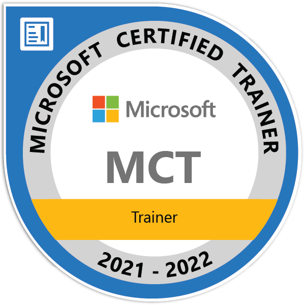
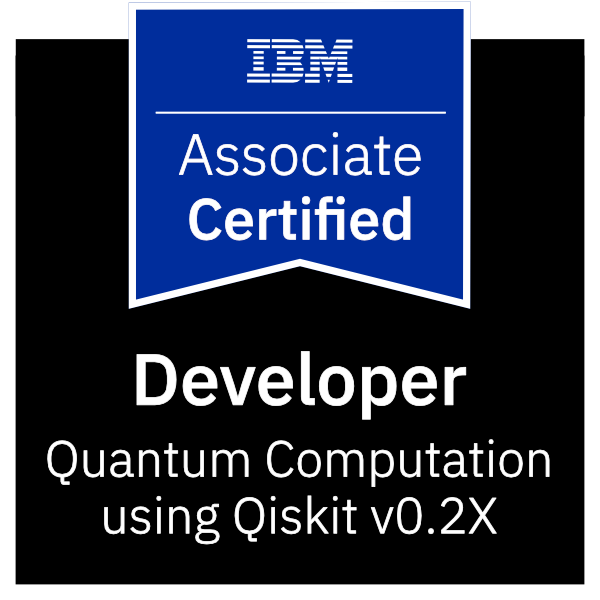
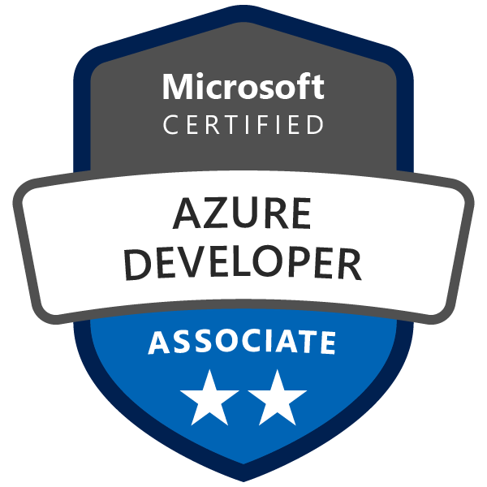
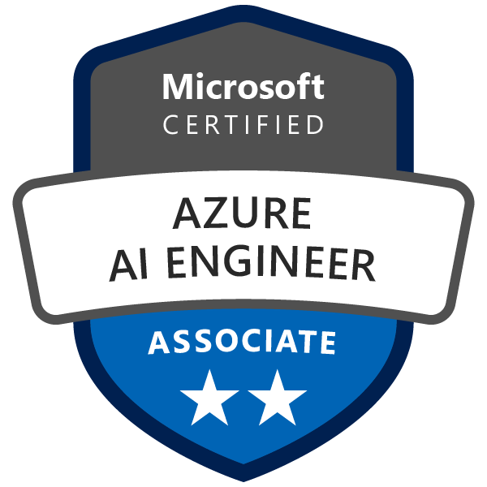
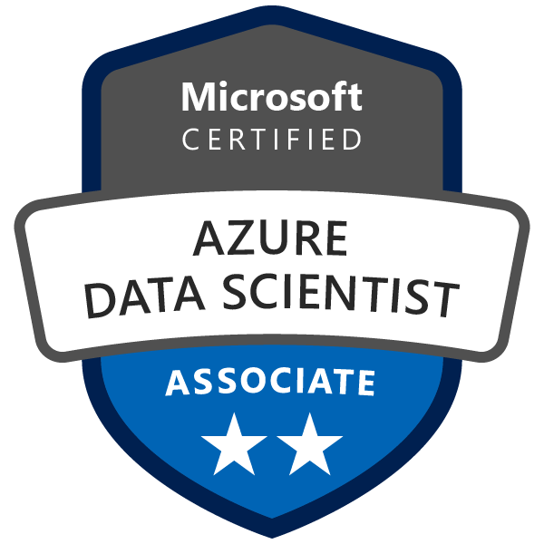

## Hi there 👋

### I'm a Software Engineer from Greece.

#### CURRENTLY

- 👾 Senior software engineer, open for interesting projects
- 👀 Actively looking for a position in Quantum Computing
- 👨‍🏫 [Training](https://www.youracclaim.com/badges/dc46755b-1c4c-4813-9098-f65447f75b49/public_url) people in Microsoft Azure technologies
- ✍️ Writing tech articles and tutorials on [Medium](https://medium.com/@fedonman)
- 💬 Mentoring young developers in hackathons and incubators
- 🧠 Organizing [Athens Deep Learning](https://www.meetup.com/athens-deep-learning/) meetup
- 📢 [Speaking](https://sessionize.com/fedonman/) in live and online events

#### FUN FACTS

- 🏢 Professionaly coding since **2011**
- ⚙️ I use daily: `.cs`, `.py`, `.sql`, `.rs`, `.qs`, `.tf`, `.yml`, `.js`, `.jsx`, `.ts`, `.vue`, 
- 💻 My [website](https://fedonman.com) is made with Gatsby and source code is hosted [here](https://github.com/fedonman/fedonman-website)
- 🌍 I'm mostly active within the **Azure Community**
- 🌱 Hyped about the coming **Quantum Computing** era
- ⚡️ Favourite quote: 井の中の蛙大海を知らず
- 💬 Ping me about **developing your dream app**, **mentoring / training**, **speaking to your event**
- 📫 Reach me: [linkedin](https://www.linkedin.com/in/fedonman/), [twitter](https://twitter.com/fedonman)

---

    
    

    
    
    

